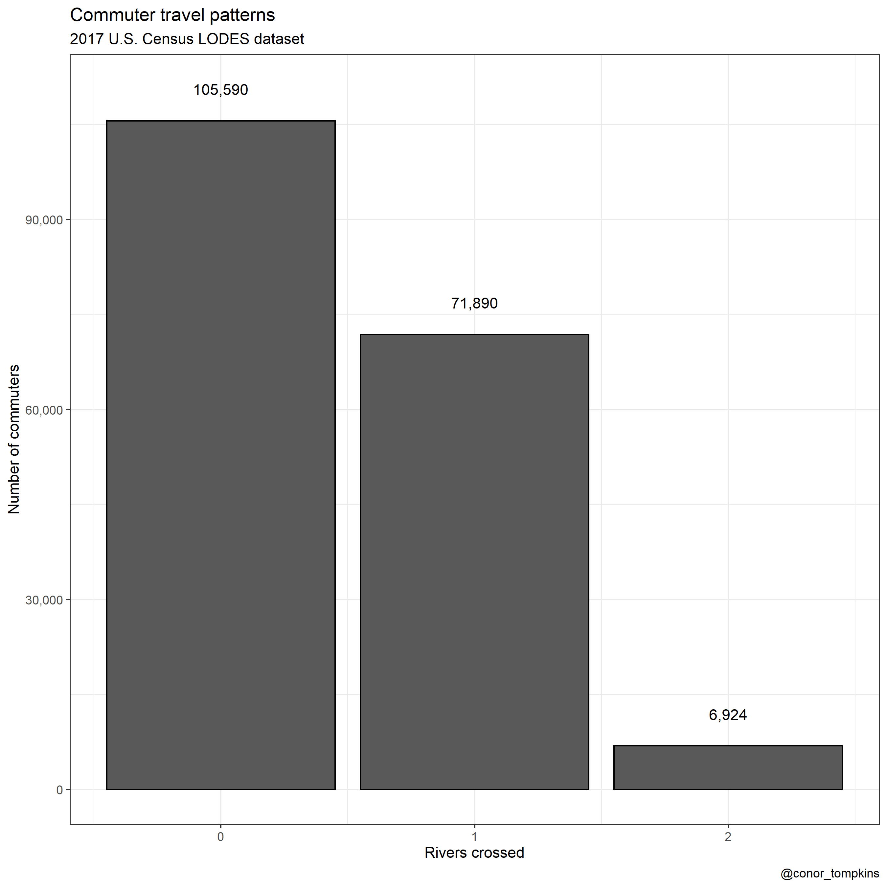
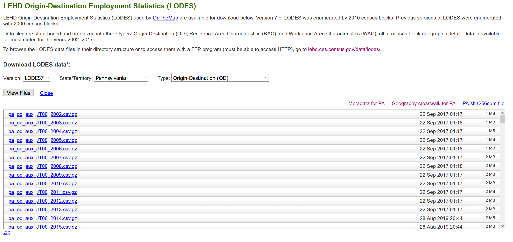

This post focuses on how many rivers Pittsburghers cross to get to work. I use the U.S. Census Bureau LEHD Origin-Destination Employment Statistics (LODES) [dataset](https://lehd.ces.census.gov/data/) to draw lines between "home" census tracts and "work" census tracts, and then count how many "commuter lines" intersect with the 3 main rivers in Pittsburgh. This calculation is done in straight lines "as the crow flies", not accounting for actual road routes.

## TLDR
A plurality of commuters don't cross any rivers, and none cross three.

Many commuters in the Golden Triangle and neighborhoods to the east don't cross rivers to get to work. Commuters from the North and South Hills areas usually cross one river. Commuters from Sewickley, Coraopolis, and those that live close to the airport are most likely to cross two rivers.

## Data munging and analysis

I use the "pa_od_aux_JT00_2017.csv" file as shown here:
{width=80% height=80%}

### References

* https://lehd.ces.census.gov/data/
* https://lehd.ces.census.gov/data/lodes/LODES7/LODESTechDoc7.4.pdf
* https://lehd.ces.census.gov/doc/workshop/2017/Presentations/TheaEvans.pdf
* https://medium.com/@urban_institute/open-accessible-data-on-jobs-and-workers-tract-level-lodes-data-945fcac9e280